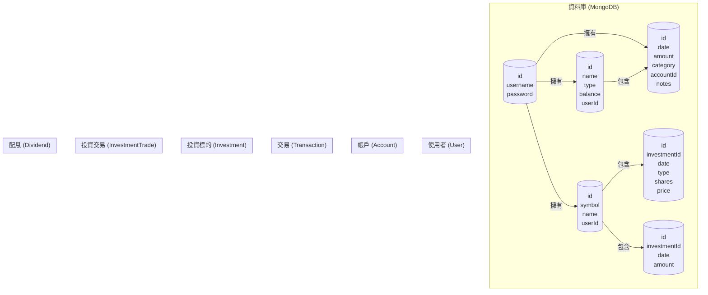

# 資料庫結構 (Schema) 說明

本文件說明了 AssetX 資產管理系統在 MongoDB 中所使用的資料結構。我們使用 Mongoose 作為 ODM (Object Data Modeling) 工具來定義這些 Schema。

## 關聯圖

---

## 1. `User.js` (使用者模型)

- **目的**: 存放使用者的基本資料，是所有其他資料的擁有者。
- **檔案位置**: `src/models/User.js`
- **欄位**:
    - `username` (String): 使用者登入帳號。此欄位是必填、唯一值，並會自動移除前後空格。
    - `password` (String): 使用者登入密碼。此欄位是必填。
        - **安全注意**: 在實作中，此密碼會經過雜湊加密 (hashing) 後才會存入資料庫。
    - `timestamps`: 自動建立 `createdAt` 和 `updatedAt` 時間戳。

---

## 2. `Account.js` (帳戶模型)

- **目的**: 定義金融帳戶，如銀行存款、信用卡、貸款等。
- **檔案位置**: `src/models/Account.js`
- **欄位**:
    - `name` (String): 帳戶的自訂名稱 (例如: "玉山銀行活存")。
    - `type` (String): 帳戶類型，必須是 `'asset'` (資產) 或 `'liability'` (負債) 其中之一。
    - `initialBalance` (Number): 帳戶建立時的初始金額。
    - `balance` (Number): 帳戶目前的餘額，會根據關聯的交易動態更新。
    - `userId` (ObjectId): **關聯欄位**，指向 `User` 模型，表示此帳戶的擁有者。

---

## 3. `Transaction.js` (交易紀錄模型)

- **目的**: 記錄每一筆收入或支出，是資金流動的核心。
- **檔案位置**: `src/models/Transaction.js`
- **欄位**:
    - `date` (Date): 交易發生的日期。
    - `amount` (Number): 交易金額。慣例為：**正數代表收入，負數代表支出**。
    - `category` (String): 交易分類 (例如: "飲食", "交通", "薪資")。
    - `accountId` (ObjectId): **關聯欄位**，指向 `Account` 模型，表示此筆交易發生的帳戶。
    - `userId` (ObjectId): **關聯欄位**，指向 `User` 模型，表示此交易的執行者。
    - `notes` (String): 交易備註。

---

## 4. `Investment.js` (投資標的模型)

- **目的**: 定義一個使用者所持有的投資標的，例如特定的股票或 ETF。
- **檔案位置**: `src/models/Investment.js`
- **欄位**:
    - `symbol` (String): 投資標的代號 (例如: "2330", "0050")。
    - `name` (String): 投資標的名稱 (例如: "台積電", "元大台灣50")。
    - `userId` (ObjectId): **關聯欄位**，指向 `User` 模型，表示此投資的擁有者。

---

## 5. `InvestmentTrade.js` (投資交易模型)

- **目的**: 記錄對某個投資標的進行的「買入」或「賣出」操作。
- **檔案位置**: `src/models/InvestmentTrade.js`
- **欄位**:
    - `investmentId` (ObjectId): **關聯欄位**，指向 `Investment` 模型，說明是對哪個標的進行交易。
    - `date` (Date): 買賣交易的日期。
    - `type` (String): 交易類型，必須是 `'buy'` (買入) 或 `'sell'` (賣出) 其中之一。
    - `shares` (Number): 交易的股數。
    - `price` (Number): 成交的每股單價。

---

## 6. `Dividend.js` (配息紀錄模型)

- **目的**: 記錄從某個投資標的所收到的現金股利。
- **檔案位置**: `src/models/Dividend.js`
- **欄位**:
    - `investmentId` (ObjectId): **關聯欄位**，指向 `Investment` 模型，說明是哪個標的發放的股息。
    - `date` (Date): 股息發放的日期。
    - `amount` (Number): 收到的股息總金額。 